<div align="center">



# simwire

**Send and receive real SMS from Node.js through your own Android phone.**
No Twilio, no signup, no per-message fees: your SIM is the gateway.

[](https://www.npmjs.com/package/simwire)
[](https://github.com/machinal-agency/simwire/actions/workflows/ci.yml)
[](LICENSE)
[](https://github.com/machinal-agency/simwire/releases/latest)

[Website](https://simwire.machinal.agency) · [Documentation](https://simwire.machinal.agency/docs) · [Download the app](https://simwire.machinal.agency/download)

</div>

---

```bash
npm install simwire
npx simwire pair        # scan the QR with the simwire Android app
```

```ts
import { connect } from "simwire";

const sms = await connect();                       // finds your phone on the LAN

const msg = await sms.send({
  to: "+15550142834",
  text: "Your code is 4821",
});
await msg.waitForDelivery();                       // real carrier status

sms.on("message", (m) => console.log(m.from, m.text));
```

Incoming messages stream straight to your machine over the LAN, so OTP flows are
testable end to end without a public webhook or a tunnel. The session recovers on
its own when Wi-Fi drops.

## Testing without a phone

The mock device mirrors the whole API, so suites run in CI on any machine.

```ts
import { mock } from "simwire";

const sms = mock();

await sms.send({ to: "+15550100000", text: "OTP: 1234" });
expect(sms.outbox).toHaveLength(1);

sms.simulateIncoming({ from: "+15550100001", text: "STOP" });
sms.simulateDrop();                                // and watch your app recover
```

## CLI

| Command | What it does |
| --- | --- |
| `simwire pair` | Shows the pairing QR and waits for the phone |
| `simwire send <to> <text>` | Sends an SMS and streams its statuses |
| `simwire listen --forward <url>` | POSTs every incoming SMS to your local server |
| `simwire doctor` | Reports why a setup is not working, with fixes |
| `simwire unpair` | Forgets the paired phone on this machine |

Every command accepts `--mock` to run against the built-in mock device.

## Repository layout

| Path | What it is |
| --- | --- |
| [`packages/sdk`](packages/sdk) | The `simwire` npm package: TypeScript SDK and CLI |
| [`packages/protocol`](packages/protocol) | Shared wire types and [PROTOCOL.md](packages/protocol/PROTOCOL.md) |
| [`apps/android`](apps/android) | The gateway app ([architecture](apps/android/ARCHITECTURE.md)) |
| [`apps/web`](apps/web) | The Astro site behind simwire.machinal.agency |

## Development

```bash
pnpm install
pnpm build
pnpm test
```

Try the CLI without a phone:

```bash
node packages/sdk/dist/cli/index.js send "+15550100000" "hello" --mock
node packages/sdk/dist/cli/index.js listen --mock
```

The Android app builds with Gradle; see [apps/android/README.md](apps/android/README.md).

## Reaching a phone from a remote server

simwire is LAN-first. To use it from a cloud backend, put the server and the
phone on the same [Tailscale](https://tailscale.com) network and pass the
phone's address:

```ts
const sms = await connect({ host: "100.101.23.45" });
```

A native relay mode is on the roadmap.

## Contributing

Bug reports from real setups are as valuable as code: no two Android
manufacturers agree on what "keep this service alive" means. See
[CONTRIBUTING.md](CONTRIBUTING.md), and [SECURITY.md](SECURITY.md) for anything
security-related.

## Fair use

Built for development, testing and small transactional volume: OTPs, alerts,
payment confirmations. Carriers throttle and ban SIMs that spam, so this is not
a bulk-messaging tool.

## License

MIT
